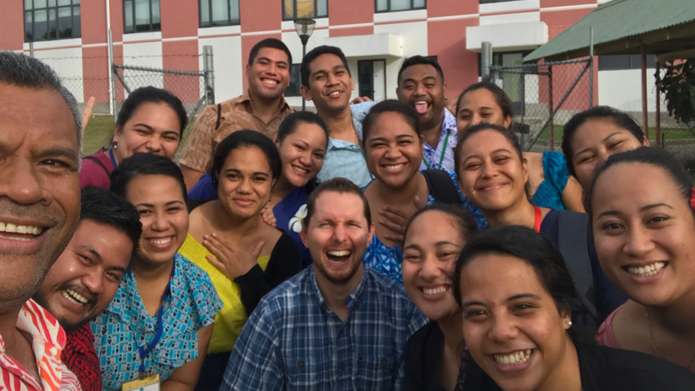
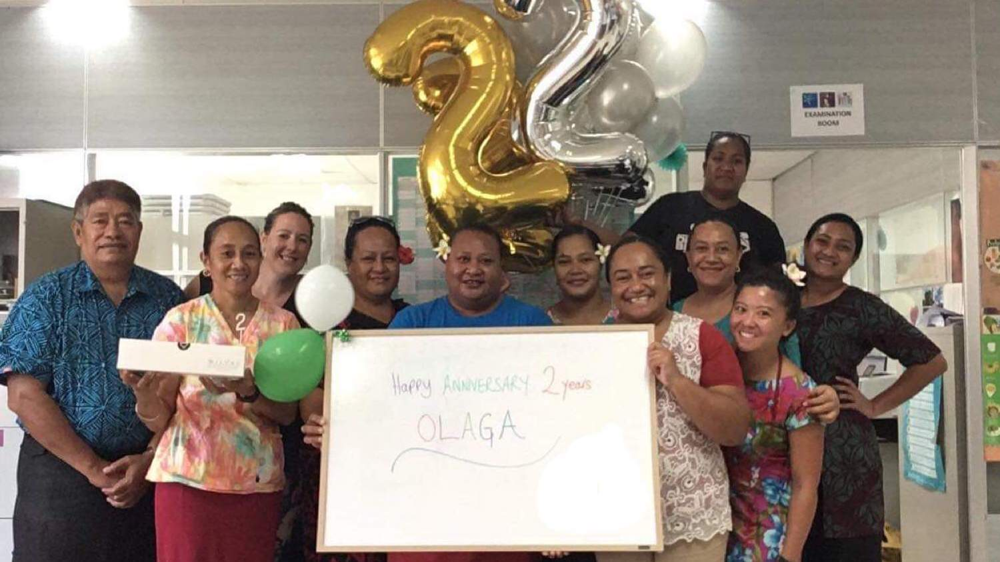

# Samoan Obesity, Lifestyle and Genetic Adaptations Study Group (OLaGA)

---

<b>In Sāmoan, *ōlaga* (pronounced /ˈoːlaŋa/) means *life*.</b>

The Obesity, Lifestyle, And Genetic Adaptations Study Group uses a life course approach to understand the origins of obesity among Samoans and other Pacific Islanders and focuses on developing culturally relevant interventions to reduce the burden of obesity and obesity-related conditions.

Goals of the Research Group

* To conduct epidemiologic research that will serve as the evidence base for developing interventions to prevent obesity
* To develop and rigorously test novel intervention approaches targeted at early life prevention of obesity and associated cardiometabolic disease
* To enhance community partnerships for local and regional capacity building

### OLaGA @ Pitt

At the University of Pittsburgh Graduate School of Public Health and Schools of Medicine and Dental Medicine, our team of genetic epidemiologists, statistical geneticists, public health geneticists, biostatisticians and molecular biologists collaborates with researchers at Yale University, Brown University, the University of Cincinnati, the National University of Samoa, the Samoan Ministry of Health, and the non-profit Lutia i Puava ‘ae Mapu i Fagalele. Nestled in and contextualized by the interdisciplinary approach of the multi-institutional Study Group, our team seeks to understand the genetic determinants of obesity and concomitant cardiometabolic disease among Samoans and the interactions of those genetic factors with environmental, behaviorial and social determinants of health.

[Current research team members and team alumni.](team.md)

### ‘Aiseā mātou te su‘esu‘eina ai kenera?

‘O le su‘esu‘ega o kenera pē mafai e kenera o tagata ona fa‘amatala le ‘ese‘esega i o lātou uiga. I a mātou su‘esu‘ega, ‘o lo‘o mātou va‘ava‘ai ai i le suiga o kenera e mafai ai ona fa‘amatala pē ‘aiseā e māfua ai ona tino puta isi tagata ‘ae lē maua ai isi. ‘O le soifuaga mālōlōina e tāua tele i le puipuiga ‘o le tino puta, peita‘i ‘o kenera e fesoasoani tele lea i lo mātou mālamalama pē ‘aiseā e tino puta ai isi tagata.

<!-- Why are we studying genetics? -->

<!-- Genetic studies test whether the genes of a group of people can explain differences in their characteristics. In our study, we are looking for genetic changes that can explain why some people are obese and others not. Healthy lifestyles are very important to preventing obesity, but genetics and also help us understand why some people become obese. -->

Our hope is that this research will come to benefit the Samoan people in Samoa, American Samoa and worldwide through
* Translation of improved understanding of the underlying biology into interventions;
* The identification of population-specific genetic determinants and prevalences or gene–environment interactions that would inform precision public health efforts;
* Building research capacity within Samoan communities; and
* Outreach to, education and empowerment of, and collaboration with Samoan communities about the ethical, legal and social implications of genetic research, genetic testing and genetics-informed interventions.

### Funded Projects

Projects currently funded by the National Institutes of Health:

* Integrated Cellular, Mouse and Human Research on a Novel Missense Variant Influencing Adiposity in Samoans

    NHLBI · [R01HL093093](https://projectreporter.nih.gov/project_info_description.cfm?aid=9693768)

* Next Generation Association Studies of Adiposity in Samoans Enhanced by a Samoan-Specific Whole Genome Sequence Reference Panel

    NHLBI · [R01HL133040](https://projectreporter.nih.gov/project_info_description.cfm?aid=9904179)

* Examining Genetic Literacy and Capacity for Engagement in Genetic Research among Pacific Islanders

    NHLBI · R01HL133040 S1

* Impact of the Obesity-Risk *CREBRF* p.Arg457Gln Variant on Energy Expenditure, Intake, and Substrate Utilization in Samoans

    NHLBI · [R01HL140570](https://projectreporter.nih.gov/project_info_description.cfm?aid=9859453)

### Gratitude

We would like to acknowledge and sincerely thank the Samoan government, particularly the Ministry of Health; the Ministry of Women, Community, and Social Development; the Office of the Prime Minister; and the Samoa Bureau of Statistics for their continued support of this work.

We would especially like to thank the amazing research participants who have allowed us to work with them over these many years and the mayors and women’s committees (*komiti tūmama*) of the villages we’ve recruited research participants from for their interest and permission to conduct this work. 

### Publications

[Selected Publications from our Group](https://danieleweeks.github.io/OLaGA-ASHG2020/pubs)

See selected publications from OLaGA in the *International Journal of Obesity*, *Nature Genetics*, the *American Journal of Human Biology*, the *Journal of Human Genetics* etc.

### Additional Information

* [OLaGA @ Yale](https://publichealth.yale.edu/olaga/)

    Visit the Yale OLaGA page for more information about the variety of studies being conducted in Samoa and American Samoa beyond the studies with a genetic focus.

* [OLaGA on Facebook](https://www.facebook.com/YaleOlaga/)

    Visit the OLaGA Facebook page to aspects of our grassroots outreach among the communities in Samoa and American Samoa.

For more information about our team, our research and our community engagement, you are welcome to contact us at [olaga@pitt.edu](mailto:olaga@pitt.edu).

|<!-- -->|<!-- -->|
|:-:|:-:|
|||
|Ministry of Health Lab Opening Moto‘otua, Apia, Samoa|Medical Student Education National University of Samoa, Apia, Samoa|
|||
|Research Meeting Pittsburgh, Pennsylvania|2nd Anniversary of Ministry of Health Lab Moto‘otua, Apia, Samoa |

---

# ASHG 2020 Posters

---

## Blood Pressure · Poster 2534

**Samoan genome-wide association studies identify novel associations with blood pressure phenotypes**

[Link to ASHG abstract](https://www.abstractsonline.com/pp8/#!/9070/presentation/3592)

Contact: Jenna Carlson via [Twitter](https://twitter.com/jenccarlson) @jenccarlson  #OLaGA #ASHG2020

---

## Height · Poster 2682

**Genome-wide association study of height in Samoan individuals**

[Link to ASHG abstract](https://www.abstractsonline.com/pp8/index.html#!/9070/presentation/2148)

Contact: Ryan Minster via [Twitter](https://twitter.com/pittjryan) @pittjryan #OLaGA #ASHG2020
 
---

## PCOS · Poster 3700

**Genome-wide association study of high vs low risk of polycystic ovarian syndrome in Samoan women**

[Link to ASHG abstract](https://www.abstractsonline.com/pp8/index.html#!/9070/presentation/3066)

Contact: Zeynep Erdogan-Yildirim via [Twitter](https://twitter.com/ZeynepEYildirim) @ZeynepEYildirim #OLaGA #ASHG2020
 
---

## Telomeres · Poster 3845

**Genome-wide association study of telomere length in individuals of Samoan ancestry**

[Link to ASHG abstract](https://www.abstractsonline.com/pp8/index.html#!/9070/presentation/3213)

Contact: Mohanraj Krishnan via [Twitter](https://twitter.com/MKrishnan) @MKrishnan #OLaGA #ASHG2020
 
---

## BMI · Poster 3961

**The missense variant, rs373863828, in *CREBRF* plays a role in longitudinal changes in BMI across adulthood**

[Link to ASHG abstract](https://www.abstractsonline.com/pp8/index.html#!/9070/presentation/3250)

Contact: Haoyi Fu via [Twitter](https://twitter.com/HaoyiFu) @HaoyiFu #OLaGA #ASHG2020
 
---

## T2D & Glucose · Poster 3772

**Association of a missense variant in *CREBRF* with type 2 diabetes and fasting glucose in a longitudinal Samoan cohort**

[Link to ASHG abstract](https://www.abstractsonline.com/pp8/index.html#!/9070/presentation/3220)

Contact: Emily Russell via [Twitter](https://twitter.com/EmilyMRussell) @EmilyMRussell #OLaGA #ASHG2020
  
---
